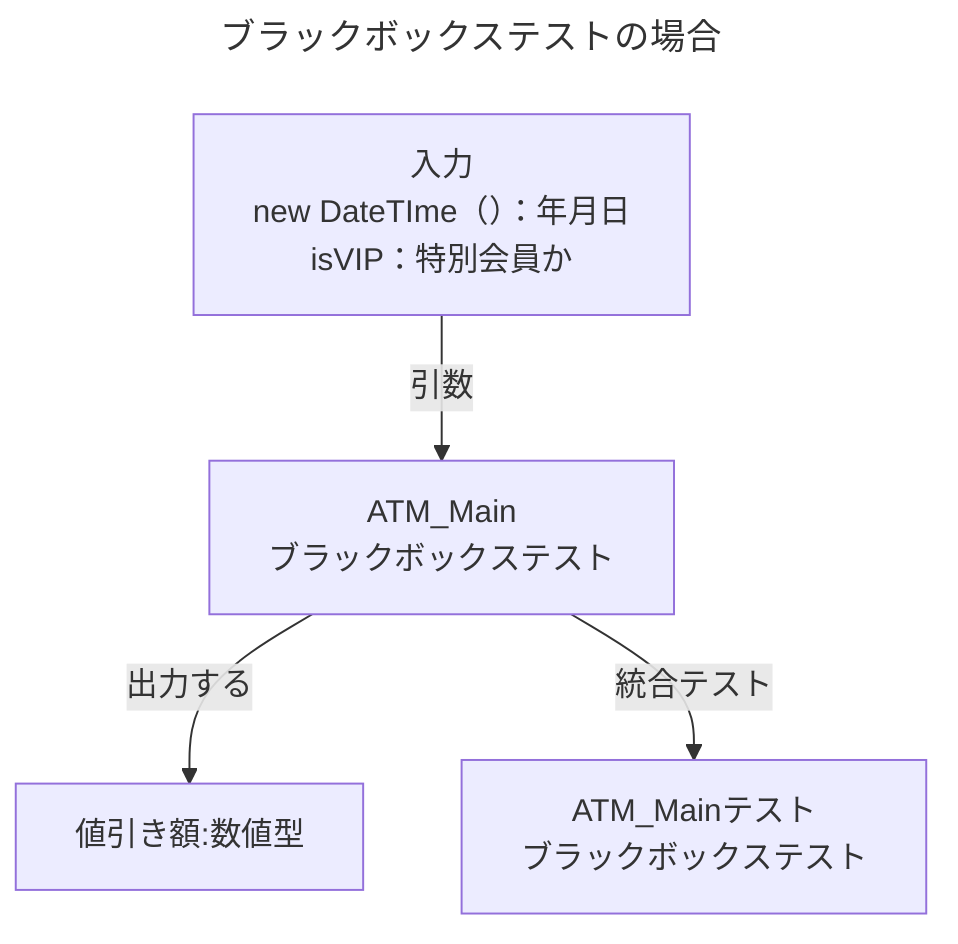
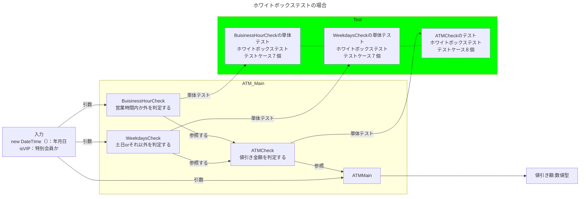

# 概要
タイトル：PHPUnitでデシジョンテスト

PHPUnit + ソフトウェアテストの勉強の一環として投稿します。

# 開発環境
PHP 8.1.28
Composer:2.7.2
phpunit: 10.5

# 題材
ATMの引出し手数料
以下ソフトウェアテスト技法練習帳~知識を経験に帰る４０問2.2.1から引用
・平日の0:00~8:44は手数料は110円です。
・平日の8:45~17:59は手数料は０円です。
・平日の18:00~23:59は手数料が110円です。
・特定の条件を満たしたお客様（特別会員）は曜日や時間に限らず手数料が０円です。

# ソフトウェアテストの用語
## ブラックボックステスト技法
仕様に対してテスト設計する技法
入力したデータと出力したデータのみを対象にするテスト

### デシジョンテーブルテスト

## ホワイトボックステスト技法
テスト対象のソフトウェアの内部構造を検証するテスト

### ステートメントテスト
命令文に対するテスト

### デシジョンテスト
if-else switch-case分岐のテスト

### 具体的には

if文がない関数のコンポーネントのテスト
→ステートメントテストのみ
　テストケースは１個

条件分岐がある関数のコンポーネントのテスト
→ステートメントテストとデシジョンテストの２種類を実行する。
テストケースは分岐の数だけ実行する。


# 図
## ブラックボックステスト


## ホワイトボックステスト


# プロダクトコード

```php::Decision.php
<?php
    class Decision{
        public function BeerCheck(bool $happyHour ,bool $coupon){
            if($happyHour && $coupon){
                return 100;
            }elseif($happyHour && !$coupon ){          
            return 100;
            }elseif(!$happyHour && $coupon){
                return 290;
            }elseif(!$happyHour && !$coupon){
            return 490;
            }
        }

        

        /**
         *  ATMの値引きを行う関数
         * 
         * @param bool $isWeekday
         * @param bool $isDuringBusinessHours
         * @param bool $isVip
         * @return int  値引きされる金額
         */
        public  function ATMCheck(bool $isWeekday, bool $isDuringBusinessHours,bool $isVip){
            if($isWeekday && $isDuringBusinessHours && $isVip){
                return 0;      
            }elseif($isWeekday && $isDuringBusinessHours && !$isVip){
                return 0;
            }elseif($isWeekday && !$isDuringBusinessHours && $isVip){
                return 110;
            }elseif($isWeekday && !$isDuringBusinessHours && !$isVip){
                return 110;
            }
            elseif(!$isWeekday && $isDuringBusinessHours && $isVip){
                return 0;
            }elseif(!$isWeekday && $isDuringBusinessHours && !$isVip){
                return 110;
            }elseif(!$isWeekday && !$isDuringBusinessHours && $isVip){
                return  0;
            }elseif(!$isWeekday && !$isDuringBusinessHours && !$isVip){
                return 110;
            }
        }

        /**
         * 営業時間　8:45~ 18:00の時はtrueを返す関数
         * @param DateTime $date
         * @return bool 営業時間の時はtrue 営業時間外の時はfalse
         */
        public function BuisinessHourCheck(DateTime $date){
            $startTime = new DateTime('8:44');
            $endTime = new DateTime('18:00');
            if($startTime->format("H:i") < $date->format("H:i") && $date->format("H:i") < $endTime->format("H:i")){
                return true;
            }else{
                return false;
            }
        }

        /**
         * DateTime型の曜日を受け取り、土日かどうかを判定する関数。
         * @param DateTime $date 曜日
         * @return bool 土日の時はfalse それ以外はtrue
         * 
         */      
        public function WeekdaysCheck(DateTime $date){
            if(in_array($date->format('w'),[0,6])){
                return false;
            }else{
                return true;
            }          
        } 
        /**
         * 
         * 
         */
        public function ATMMain(DateTime $date,bool $isVip){
           return $this->ATMCheck($this->WeekdaysCheck($date),$this->BuisinessHourCheck($date),$isVip);
        }
    }
?>


```

# テストコード
```test/php:DecisionTest.php
<?php

use PHPUnit\Framework\TestCase;
use PHPUnit\Framework\Attributes\CoversClass;
require_once(dirname(__FILE__).'/../product/Decision.php');

// Dockerコンテナ内で以下コマンドを実行
// vendor/phpunit/phpunit/phpunit tests/DecisionTest.php 

/**
* @covers Decision\Decision
*/
#[CoversClass(Decision::class)]
class DecisionTest extends TestCase
{
    
    /**
    *  
    * @dataProvider beerPattern
    */
    public function testBeer($happyHour,$coupon,$expectedResult){
        $decision = new Decision();    
        $this->assertSame($expectedResult, $decision->BeerCheck($happyHour,$coupon));
    }
    // ビールのテストパターン
    public function beerPattern()
    {
        return [
            'ハッピーアワー:◯ クーポン利用◯ 100円になる' =>[true,true,100],
            'ハッピーアワー:◯ クーポン利用☓ 100円になる' =>[true,false,100],
            'ハッピーアワー:☓ クーポン利用◯ 290円になる' =>[false,true,290],
            'ハッピーアワー:☓ クーポン利用☓ 490円になる' =>[false,false,490],
        ];
    }

    /**
    * 営業時間判定の単体テスト
    * 
    * @dataProvider buisinessHourPattern
    */
    public function testBuisinessHour($actualDate, $expectedResult){
        $decision = new Decision();    
        $this->assertSame($expectedResult, $decision->BuisinessHourCheck($actualDate));
    }

    /**
     * 営業時間判定のテストパターン
     * ホワイトボックステスト
     */
    public function buisinessHourPattern(){
        return[
            '業務時間外朝（代表値）' => [new DateTime('2024-04-07 6:44'),false],
            '業務時間外朝（境界値）' => [new DateTime('2024-04-07 8:44'),false],
            '業務時間外朝（境界値）' => [new DateTime('2024-04-07 8:45'),true],
            '業務時間内（代表値）' => [new DateTime('2024-04-07 13:45'),true],
            '業務時間内（境界値）' => [new DateTime('2024-04-07 17:59'),true],
            '業務時間外夜（境界値）' => [new DateTime('2024-04-07 18:00'),false],
            '業務時間外夜（代表値）' => [new DateTime('2024-04-07 22:00'),false],
        ];
    }
    /**
    * 曜日判定の単体テスト 
    * 土日の時はfalse,それ以外の時はtrueになることを確認するテスト 
    * ホワイトボックステスト　ステートメント
    * カバレッジ率はレポートを参照
    * @dataProvider weekdaysCheckPattern
    */
    public function testWeeksaysCheck($date,$expectedResult){
        $decision = new Decision();    
        $this->assertSame($expectedResult, $decision->WeekdaysCheck($date));
    }

    // 曜日判定のテストパターン
    public function weekdaysCheckPattern(){
        return[
            '日曜日の場合' => [new DateTime('2024-04-07'),false],
            '月曜日の場合' => [new DateTime('2024-04-08'),true],
            '火曜日の場合' => [new DateTime('2024-04-09'),true],
            '水曜日の場合' => [new DateTime('2024-04-10'),true],
            '木曜日の場合' => [new DateTime('2024-04-11'),true],
            '金曜日の場合' => [new DateTime('2024-04-12'),true],
            '土曜日の場合' => [new DateTime('2024-04-13'),false]
        ];
    }
    /**
    * ATM値引き関数の単体テスト 
    * 引数は平日無
    * いずれの引数もbool型で、各々の分岐が正しいことを確認することが目的
    * ホワイトボックステスト　ステートメント
    * カバレッジ率はレポートを参照
    * @dataProvider ATMCheckPattern
    */
    public function testATMCheckTest($isWeekday,$isDuringBusinessHours,$isVip,$expectedResult){
        $decision = new Decision();    
        $this->assertSame($expectedResult, $decision->ATMCheck($isWeekday,$isDuringBusinessHours,$isVip));
    }

    // ATM値引き関数のテストパターン
    public function ATMCheckPattern(){
            return[
                'Case1：平日:〇 営業時間内:〇 特別会員：〇 結果値0円' => [true,true,true,0],
                'Case2：平日:〇 営業時間内:〇 特別会員：× 結果値0円' => [true,true,false,0],
                'Case3：平日:〇 営業時間内:× 特別会員：〇 結果値110円' => [true,false,true,110],
                'Case4：平日:〇 営業時間内:× 特別会員：× 結果値110円' => [true,false,false,110],
                'Case5：平日:× 営業時間内:〇 特別会員：〇 結果値0円' => [false,true,true,0],
                'Case6：平日:× 営業時間内:〇 特別会員：× 結果値110円' => [false,true,false,110],
                'Case7：平日:× 営業時間内:× 特別会員：〇 結果値0円' => [false,false,true,0],
                'Case8：平日:× 営業時間内:× 特別会員：× 結果値110円' => [false,false,false,110],
            ];
    }    

    
    /**
    * 統合テスト 
    * ブラックボックステスト-デシジョンテーブル
    * 条件の組み合わせで要件を満たしているか確認する。
    * 条件：
    * １．平日内か外か
    * ２．営業時間内か外か
    * ３．特別会員かどうか
    * 結果：割引額(円)
    *
    * @dataProvider ATMMainPattern
    */
    public function testATMMain($date,$isVip,$expectedResult){
        $decision = new Decision();    
        $this->assertSame($expectedResult, $decision->ATMMain($date,$isVip));
    }
     
    // 統合テストのテストパターン
    public function ATMMainPattern(){
        return[
            'Case1：平日:〇 営業時間内:〇 特別会員：〇 結果値0円' => [new DateTime('2024-04-10 13:45'),true,0],
            'Case2：平日:〇 営業時間内:〇 特別会員：× 結果値0円' => [new DateTime('2024-04-10 13:45'),false,0],
            'Case3：平日:〇 営業時間内:× 特別会員：〇 結果値0円' => [new DateTime('2024-04-07 19:45'),true,0],
            'Case4：平日:〇 営業時間内:× 特別会員：× 結果値110円' => [new DateTime('2024-04-07 20:45'),false,110],
            'Case5：平日:× 営業時間内:〇 特別会員：〇 結果値0円' => [new DateTime('2024-04-13 13:45'),true,0],
            'Case6：平日:× 営業時間内:〇 特別会員：× 結果値110円' => [new DateTime('2024-04-13 13:45'),false,110],
            'Case7：平日:× 営業時間内:× 特別会員：〇 結果値0円' => [new DateTime('2024-04-13 19:45'),true,0],
            'Case8：平日:× 営業時間内:× 特別会員：× 結果値110円' => [new DateTime('2024-04-13 19:45'),false,110],
        ];
    }
}


```


# カバレッジ

# 改善点
HTML+Javascriptでの入力、出力処理も含める。
HTML+JSから入力→PHPで演算処理→HTMLで出力

#  参考

ブラックボックステスト技法-デシジョンテーブルテストについて
ソフトウェアテスト教科書　JSTQB Fundation 第４版　シラバス20218


ホワイトボックス技法 4.3.1 ステートメントテストとカバレッジ
ソフトウェアテスト教科書　JSTQB Fundation 第４版　シラバス20218

ソフトウェアテスト技法　練習帳　知識を経験に変える40問
Part2　銀行ATMの引き出し手数料

dataProvider