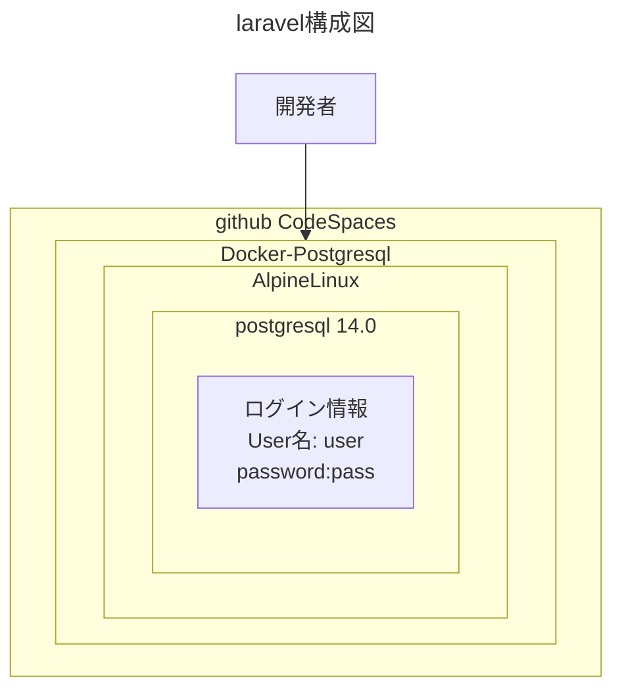

# 概要
OSSDB　SilverのSQL文を試すためのリポジトリです。　

#  構成図




# フォルダ、ファイル名
フォルダ名|説明|
----|----
 docker-compose.yml|ファイルの説明
 docker/postgres|DockerFile 最初に実行されるsqlが含まれている
 src|勉強で使うsql文


# コマンド

```bash
# dockerコンテナを構築
docker-compose build

# docker コンテナを起動
docker-compose up -d

##  確認作業
# ユーザー情報を確認
docker exec -it postgresql  psql -U docker -c "\du"
# テーブル情報を確認
docker exec -it postgresql  psql -U docker -c "\d"
# sample.sql実行する
docker-compose  exec -it postgresql  psql -U docker -f src/postgresql/sample.sql -d docker
```


# 確認結果

## ユーザー情報
```bash

```

## テーブル情報

```bash

```


# 参考

dockerコンテナの作成方法

https://amateur-engineer.com/docker-compose-postgresql/#toc5

sql文
OSS教科書　OSS-DB Silver Ver3.0対応
第８章　SQLとオブジェクト